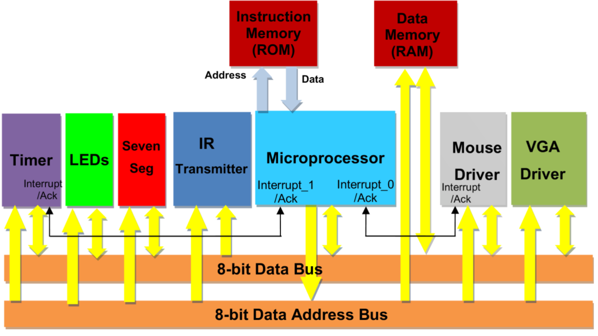

# Silly Car Game

## Arch

Controlled by a 8-bit single-cycle CPU with 2 regs (a,b)

## ISA Summary

### Math 

| Opp  | Rd  |     | Description       |
|------|-----|-----|-------------------|
| add  | reg |     | reg = a + b       |
| sub  | reg |     | reg = a - b       |
| mul  | reg |     | reg = a * b       |
| sll  | reg |     | reg = a << b      |
| srl  | reg |     | reg = a >> b      |
| inca | reg |     | reg = a + 1       |
| incb | reg |     | reg = b + 1       |
| deca | reg |     | reg = a - 1       |
| decb | reg |     | reg = b - 1       |
| eq   | reg |     | reg = a == b      |
| gt   | reg |     | reg = a > b       |
| lt   | reg |     | reg = a < b       |

## Memory 

| Opp  | Rd  | MEM  |     | Description       |
|------|-----|------|-----|-------------------|
| ldb  | reg | ADDR |     | reg = [ADDR]      |
| stb  | reg | ADDR |     | [ADDR] = reg      |
| dref | reg |      |     | reg = [reg]       |

## Branch 

| Opp  | MEM  |     | Description                  |
|------|------|-----|------------------------------|
| beq  | ADDR |     | branch if a == b             |
| bgt  | ADDR |     | branch if a > b              |
| blt  | ADDR |     | branch if a < b              |
| goto | ADDR |     | unconditional branch         |
| idle |      |     | unconditional branch to idle |
| call | ADDR |     | call subroutine              |
| ret  |      |     | return from subroutine       |